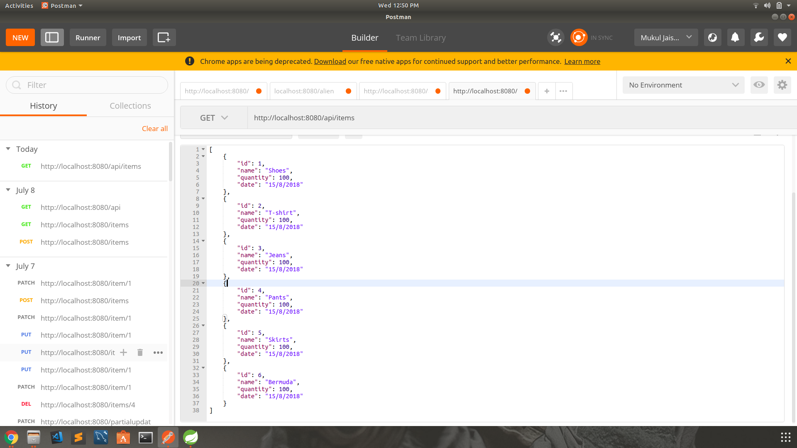
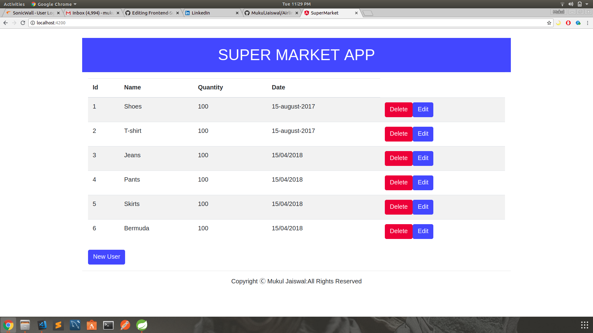

# Internship Project

This Repository contains Restful Api CRUD operations using Spring Boot ,JPA and Hibernate in the Backend and Front End is Developed using Angular v6.

```
Run Project : Download or clone -> Import project ->Run as Spring Boot Application
```

# Back-End Details
In Back-End APIs are developed using Spring Boot Jpa and Hibernate.
```
Using Spring Boot embedded Tomcat Server.
```
```
Database Name : springbootapi
```
## APIs Developed for  :

```
1.getItems             -----GET

2.getItems by ID       -----GET

3.addItems             -----POST

4.updateItems          -----PUT

5.updateItemByID       -----PUT

6.deleteAllItems       -----DELETE

7.patchUpdateById      -----PATCH

```
## Preview Back-End



# Front-End Detail

This project was generated with [Angular CLI](https://github.com/angular/angular-cli) version 6.0.8.

## Development server

Run `ng serve` for a dev server. Navigate to `http://localhost:4200/`. The app will automatically reload if you change any of the source files.

## Code scaffolding

Run `ng generate component component-name` to generate a new component. You can also use `ng generate directive|pipe|service|class|guard|interface|enum|module`.

## Build

Run `ng build` to build the project. The build artifacts will be stored in the `dist/` directory. Use the `--prod` flag for a production build.

## Running unit tests

Run `ng test` to execute the unit tests via [Karma](https://karma-runner.github.io).

## Running end-to-end tests

Run `ng e2e` to execute the end-to-end tests via [Protractor](http://www.protractortest.org/).

## Further help

To get more help on the Angular CLI use `ng help` or go check out the [Angular CLI README](https://github.com/angular/angular-cli/blob/master/README.md).

## Preview Front End


## License

This project is licensed under the Apache License 2.0  - see the [LICENSE.md](LICENSE.md) file for details

## Author

* **Mukul Jaiswal** -
